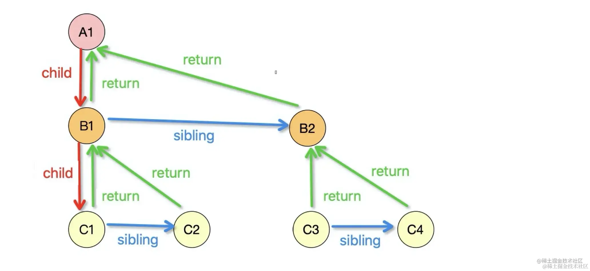

[参考文献]("https://juejin.cn/post/7258881840823844920")
[参考文献]("https://juejin.cn/post/7331135154209308687")
## fiber 讲解

### fiber 形成
- react fiber 采用链表的形式实现的，每个虚拟dom 都可以理解为是一个 fiber
- 
- 每个节点都是一个 fiber， 包含 `child 第一个节点`、 `sibling 兄弟节点`、 `return 父节点`。
- 在首次渲染的时候，会创建一个 `FiberRoot` 整个应用根节点 和 `rootFiber` 组件的根节点
- 在 React 中 最多存在两颗 fiber树， 一颗是当前展示的 `current Fiber`、另一颗是 正在内存中构建的 `workInProgress fiber树`

## Effect list 副作用列表
- 在 React 中，`修改 DOM`、`发送网络请求`、`更新状态`等，都会有副作用，为了确保副作用的操作都在适当的时机，fiber 会形成一个 effect list 来收集和管理副作用
- effect list 包含以下信息
  - 副作用类型 effect type: 表示该节点对应的副作用操作类型，如 更新dom
  - 副作用标记 Tag：表示该节点的状态，如 更新（update）、删除（Deletion）、新增（Placement）
  - 目标对象 Target: 执行副作用具体的操作对象，比如要更新的DOM，或者要发送请求的接口。
- 